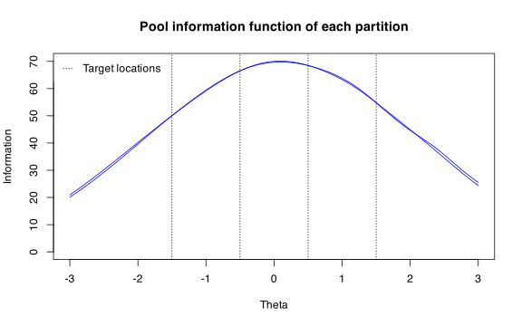
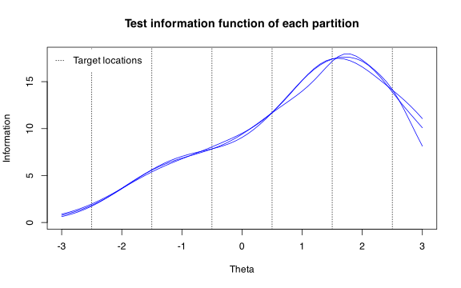
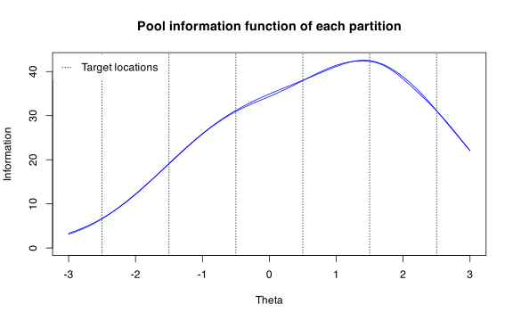

<br/>

### Introduction

This document explains how to use `Split()` to create parallel tests or sub-pools. The partitioning method used in `Split()` is an experimental method that we developed (a manuscript forthcoming). The `Split()` function can be used to split an existing item pool into multiple tests or sub-pools, optimally assembled to have minimal information difference between all partition pairs, subject to additional constraints described below.

When used to create parallel tests, the method ensures that all tests satisfy all content constraints. A unique and practical benefit of the method is when it is used to create parallel sub-pools. The pools created this way are constructed so that they contain at least one complete test that satisfies all content constraints.

The `Split()` function is available from *TestDesign* version 1.3.0. Interested users can look forward to our manuscript currently in preparation.

### Example: discrete items (`science` pool)


```r
cfg <- createStaticTestConfig(
  MIP = list(solver = "GUROBI"),
  item_selection = list(target_location = c(-1.5, -0.5, 0.5, 1.5))
)
constraints <- constraints_science[1:10]
```


```r
parallel_tests <- Split(cfg, constraints, n_partition = 4, partition_type = "test")
plot(parallel_tests)
```


```r
parallel_pools <- Split(cfg, constraints, n_partition = 2, partition_type = "pool")
plot(parallel_pools)
```



### Example: set-based items (`reading` pool)

`Split()` retains the set-based structure in a way that each item set is assigned to only one partition.


```r
cfg <- createStaticTestConfig(
  MIP = list(solver = "GUROBI", obj_tol = 0.25),
  item_selection = list(target_location = c(-2.5, -1.5, -0.5, 0.5, 1.5, 2.5))
)
constraints <- constraints_reading[1:5]
```


```r
parallel_tests <- Split(cfg, constraints, n_partition = 3, partition_type = "test")
plot(parallel_tests)
```



Because partitions are created by assigning intact item sets, a solution that exactly matches certain partition sizes may not exist. The code below allows partition sizes to vary between 140 and 160.


```r
parallel_pools <- Split(
  cfg, constraints, n_partition = 2, partition_type = "pool",
  partition_size_range = c(140, 160)
)
plot(parallel_pools)
```


